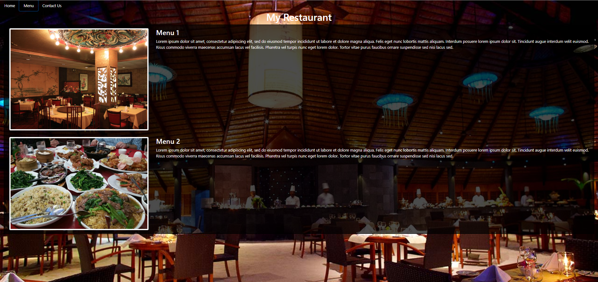

# Restaurant Page

> A restaurant page created with the javascript bundler webpack.




## Built With

- HTML5
- Javascript
- Webpack 4
- Bootstrap 4.5
- ESLint
- StyleLint
- Node 

### Prerequisites

- Node ^10
- npm ^6

## Getting Started

To get a local copy up and running follow these simple example steps.

### Setup

Clone the repo:

```
git clone https://github.com/abdelp/restaurant-page-js.git
```

Inside the root folder of the project, install the node packages:

```
npm install
```

### Usage

Go to the root folder and open and run the npm server script:

```
npm run server
```


## Author

👤 **Abdel Pérez**

- Github: [@abdelp](https://github.com/abdelp)
- Twitter: [@AbdelPerez11](https://twitter.com/AbdelPerez11)
- Linkedin: [abdel-perez](https://linkedin.com/in/abdel-perez)


## 🤝 Contributing

Contributions, issues and feature requests are welcome!

Feel free to check the [issues page](issues/).

## Show your support

Give a ⭐️ if you like this project!

## 📝 License

This project is [MIT](lic.url) licensed.